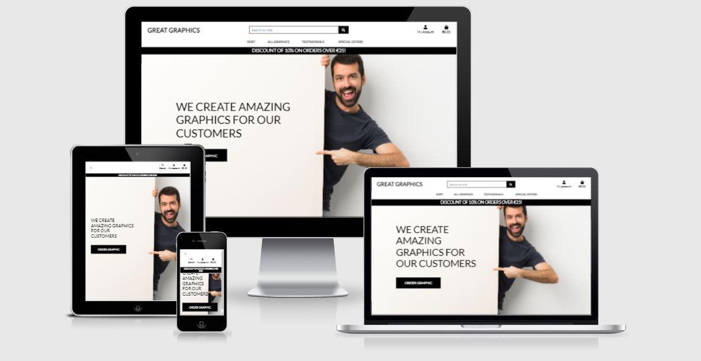

<h1 align="center">Code Institute Website</h1>

[View the live project here.](https://great-graphics.herokuapp.com/)

This is the main marketing website for Great Graphics.
It is designed to be responsibe and accessible on a range of devices, making it easy to navigate for potential customers and business partners.

<h2 align="center"></h2>


## User Experience (UX)

-   ### User stories

    -   #### First Time Visitor Goals

        1. As a First Time Visitor, I want to easily understand the main purpose of the site and learn more about the organisation.
        2. As a First Time Visitor, I want to be able to easily navigate throughout the site to find content.
        3. As a First Time Visitor, I want to look for testimonials to understand what their users think of them and see if they are trusted.
        4. As a First Time Visitor, I want to find a list of graphics.
        5. As a First Time Visitor, I want to find prices vs. different graphics.
        6. As a First Time Visitor, I want to search for a product by name.


    -   #### Returning Visitor Goals

        1. As a Returning Visitor, I want to register for an account.
        2. As a Returning Visitor, I want a user profile with my order history.
        3. As a Returning Visitor, I want to receive email confirmation after registration.
        4. As a Returning Visitor, I want to view items in a shopping bag.
        5. As a Returning Visitor, I want to use safe payment methods.
        6. As a Returning Visitor, I want to receive an email confirming my purchases.


-   ### Design
  
    -   #### Imagery
        -   Imagery is important. The large, background hero image is designed to be striking and catch the user's attention. It also has a modern, energetic aesthetic.

-   ### Wireframes

    -   Home Page Wireframe - [View](/documentation/wireframes/home.pdf)
    -   Shopping Bag Wireframe - [View](/documentation/wireframes/bag.pdf/)
    -   Testimonials Page Wireframe - [View](/documentation/wireframes/testimonials.pdf)
    -   Order Graphic Page Wireframe - [View](/documentation/wireframes/order_graphic.pdf)
    -   Registration Page Wireframe - [View](/documentation/wireframes/register.pdf)


## Features
-   Responsive on all device sizes.
-   Interactive elements.

## Technologies Used

### Languages Used

-   [HTML5](https://en.wikipedia.org/wiki/HTML5)
-   [CSS3](https://en.wikipedia.org/wiki/Cascading_Style_Sheets)
-   [python](https://en.wikipedia.org/wiki/Python_(programming_language))
-   [JavaScript](https://en.wikipedia.org/wiki/JavaScript)


### Frameworks, Libraries & Programs Used

1. [Bootstrap 4.4.1:](https://getbootstrap.com/docs/4.4/getting-started/introduction/)
    - Bootstrap was used to assist with the responsiveness and styling of the website.
2. [Hover.css:](https://ianlunn.github.io/Hover/)
    - Hover.css was used on the sites buttons..
3. [Google Fonts:](https://fonts.google.com/)
    - Google fonts were used to import the 'Lato' font into the style.css file which is used on all pages throughout the project.
4. [Font Awesome:](https://fontawesome.com/)
    - Font Awesome was used on all pages throughout the website to add icons for aesthetic and UX purposes.
5. [jQuery:](https://jquery.com/)
    - jQuery came with Bootstrap to make the navbar responsive.
6. [Git:](https://git-scm.com/)
    - Git was used for version control by utilizing the Gitpod terminal to commit to Git and Push to GitHub.
7. [GitHub:](https://github.com/)
    - GitHub is used to store the projects code after being pushed from Git.
8. [Balsamiq:](https://balsamiq.com/)
    - Balsamiq was used to create the wireframes during the design process.
9. [Freepik:](https://www.freepik.com/home)
    - All media images were sourced with a Freepik premium licence.
10. [ami.responsive:](http://ami.responsivedesign.is/)
    - Image at the top of this readme generated by ami.responsive.

## Font Awesome icons used:

- fas fa-search
- fas fa-user
- fas fa-shopping-bag
- fas fa-chevron-left
- fas fa-lock
- fas fa-minus
- fas fa-plus
- fas fa-arrow-up
- fas fa-chevron-left
- fas fa-lock
- fas fa-exclamation-circle
- fas fa-times
- fas fa-spin
- fas fa-angle-left
- fas fa-gifts

## Testing

The W3C Markup Validator and W3C CSS Validator Services were used to validate every page of the project to ensure there were no syntax errors in the project.

-   [W3C Markup Validator](https://validator.w3.org/#validate_by_uri)
-   [W3C CSS Validator](https://jigsaw.w3.org/css-validator/#validate_by_input)


CSS Results

-   base.css - [View](/validation/base_css.pdf)
-   checkout.css - [View](/validation/checkout_css.pdf)
-   profile.css - [View](/validation/profile_css.pdf)


HTML Results
-   index.html - [View](/validation/index_html.pdf)
-   login.html - [View](/validation/login_html.pdf)
-   register.html - [View](/validation/register_html.pdf)
-   graphics.html - [View](/validation/graphics_html.pdf)
-   add graphic.html - [View](/validation/add_graphic_html.pdf)
-   edit graphic.html - [View](/validation/edit_graphic_html.pdf)
-   graphic detail.html - [View](/validation/graphic_detail_html.pdf)
-   testimonials.html - [View](/validation/all_testimonials_html.pdf)
-   add testimonial.html - [View](/validation/add_testimonial_html.pdf)
-   edit testimonial.html - [View](/validation/edit_testimonial_html.pdf)
-   bag.html - [View](/validation/bag_html.pdf)
-   checkout.html - [View](/validation/checkout_html.pdf)
-   checkout success.html - [View](/validation/checkout_success_html.pdf)
-   user profile.html - [View](/validation/user_profile_html.pdf)


### Testing User Stories from User Experience (UX) Section

-   #### First Time Visitor Goals

    1. As a First Time Visitor, I want to easily understand the main purpose of the site and learn more about the organisation.

        1. Upon entering the site, users are automatically greeted with a clean and easily readable navigation bar to go to the page of their choice. Underneath there is a Hero Image with Text and an "Order Graphic" Call to action button.
        2. The main points are made immediately with the main text and the hero image.
        3. The user has two options, click the Order Graphic buttons or click on the All Graphics link, both of which will lead to the same place, to learn more about the organisations products.


    2. As a First Time Visitor, I want to be able to easily navigate throughout the site to find content.

        1. The site has been designed to be fluid and to never entrap the user. At the top of each page there is a clean navigation bar, where each link clearly describes what page they will end up at.


    3. As a First Time Visitor, I want to look for testimonials to understand what their users think of them and see if they are trusted.
        1. The site has a dedicated testimonials page where users can add their testimoials.

   
    4. As a First Time Visitor, I want to find a list of the sites products.
        1. The site has two links to list products and to sort them.
        2. There is also a link to any deals.


    5. As a First Time Visitor, I want to find prices for different graphics.
        1. The site has a dedicated sorting links to help customers find the graphic that best suits their needs.


    6. As a First Time Visitor, I want to search for a product by name.
        1. The site has a dedicated search field where users can search by name or by description.


-   #### Returning Visitor Goals

    1. As a Returning Visitor, I want to register for an account.
        1. The clearly labelled My Account Icon directs returning visitors to Registration and Login pages.


    2. As a Returning Visitor, I want a user profile with my order history.
        1. The order form allows users to keep a record of their purchase history on their account.


    3. As a Returning Visitor, I want to receive email confirmation after registration.
        1. The site is configured so that a user receives a confirmation email after registration. The user must click on a button which [confirms](/validation/confirm_email.pdf) that their email address matches their account.


    4. As a Returning Visitor, I want to view items in a shopping bag.
        1. The site is configured so that users can view and update the contents in their shopping bag.


    5. As a Returning Visitor, I want to use safe payment methods.
        1. The site uses stripe to maintain secure credit card transactions.


    6. As a Returning Visitor, I want to receive an email confirming my purchases.
        1. The site sends users a confirmation email listing their [purchases](/validation/order_confirmation_email.pdf).


-   #### Frequent User Goals


### Test Driven Development (TDD)

-   Please see TDD reference in commit messages

-   TDD1: - 
Code does not sort with graphicsTDD = graphics.order_by(sortkey) in graphics/views.py, each sort pulldown gives the same sort output on screen.
Code works correctly with graphics = graphics.order_by(sortkey).
Graphic sorting tested for each menu item both asc and desc.

-   TDD2: - 
add path('bag/', include('bag.urls')), to great_graphics/urls.py
add href=""> to HTML files
add path('', views.view_bag, name='view_bag') to bag/urls.py
add return render(request, 'bag/bag.html') to bag/views.py
python does not run when code in bag/urls.py is changed to path('', views.view_bagTDD, name='view_bag')
browser shows https://8000-violet-fox-0sxtge1d.ws-eu18.gitpod.io/bag/ when bag button is hit wit correct code.


### Further Testing

-   The website was viewed on a variety of devices such as Desktop, Laptop, iPhone7, iPhone 8 & iPhoneX.
-   A large amount of testing was done to ensure that all pages were linking correctly.
-   Friends and family members were asked to review the site and documentation to point out any bugs and/or user experience issues.

### Known Bugs

-   Social media Icons to be added.
-   Testimonial pages need to be styled.
-   Edit testimonial must only work for the author of the testimonial and the superuser.
-   Can email be modified to originate from great.graphics.com insetad of example .com.
-   tests.py to be updated with tests for each app.

### Flake8

tests.py linter errors not fixed as tests must be added.
in certain circumstances warnings with lines to long were not modified due to the risk of breaking the functionality of the code.
-   linter results - [View](/validation/linter.pdf)


## Deployment

### GitHub Pages

The project was deployed to GitHub Pages using the following steps...

1. Log in to GitHub and locate the [GitHub Repository](https://github.com/)
2. At the top of the Repository (not top of page), locate the "Settings" Button on the menu.
    - Alternatively Click [Here](https://raw.githubusercontent.com/) for a GIF demonstrating the process starting from Step 2.
3. Scroll down the Settings page until you locate the "GitHub Pages" Section.
4. Under "Source", click the dropdown called "None" and select "Master Branch".
5. The page will automatically refresh.
6. Scroll back down through the page to locate the now published site [link](https://github.com) in the "GitHub Pages" section.

### Forking the GitHub Repository

By forking the GitHub Repository we make a copy of the original repository on our GitHub account to view and/or make changes without affecting the original repository by using the following steps...

1. Log in to GitHub and locate the [GitHub Repository](https://github.com/)
2. At the top of the Repository (not top of page) just above the "Settings" Button on the menu, locate the "Fork" Button.
3. You should now have a copy of the original repository in your GitHub account.

### Making a Local Clone

1. Log in to GitHub and locate the [GitHub Repository](https://github.com/)
2. Under the repository name, click "Clone or download".
3. To clone the repository using HTTPS, under "Clone with HTTPS", copy the link.
4. Open Git Bash
5. Change the current working directory to the location where you want the cloned directory to be made.
6. Type `git clone`, and then paste the URL you copied in Step 3.

```
$ git clone https://github.com/YOUR-USERNAME/YOUR-REPOSITORY
```

7. Press Enter. Your local clone will be created.

```
$ git clone https://github.com/YOUR-USERNAME/YOUR-REPOSITORY
> Cloning into `CI-Clone`...
> remote: Counting objects: 10, done.
> remote: Compressing objects: 100% (8/8), done.
> remove: Total 10 (delta 1), reused 10 (delta 1)
> Unpacking objects: 100% (10/10), done.
```

Click [Here](https://help.github.com/en/github/creating-cloning-and-archiving-repositories/cloning-a-repository#cloning-a-repository-to-github-desktop) to retrieve pictures for some of the buttons and more detailed explanations of the above process.

## Credits

### Code


-   Favicon was created in MS Excel and then generated by https://www.favicon-generator.org
-   [Bootstrap4](https://getbootstrap.com/docs/4.4/getting-started/introduction/): Bootstrap Library used throughout the project mainly to make site responsive using the Bootstrap Grid System.
-   [MDN Web Docs](https://developer.mozilla.org/) : For Pattern Validation code. Code was modified to better fit my needs and to match an Irish phone number layout to ensure correct validation. Tutorial Found [Here](https://developer.mozilla.org/en-US/docs/Web/HTML/Element/input/tel#Pattern_validation)

### Content

-   The code was generated from the Code Institute Boutique Ado Project.
-   The Template pages were generated from the Code Institute Hello Django Project.
-   All content was written by the developer.
-   Psychological properties of colours text in the README.md was found [here](http://www.colour-affects.co.uk/psychological-properties-of-colours)

### Media

-   All Images were sourced from Freepik.


### Acknowledgements

-   My Mentor Guido Cecilio for continuous helpful feedback.
-   Tutor support at Code Institute for their support.
-   Tutor support. db.sqlite3 was corrupted when a model was updated with data in the database. The major part of the database with graphics and categories were downloaded as a JSON file before the database was recreated.

### Bug Fixes

-   Small Bug. checkout.models had a problem with mismatching variables.

checkout/models.py

        self.order_total = self.lineitems.aggregate(Sum('lineitem_total'))['lineitem_total__sum'] or 0
        if self.order_total > settings.DISCOUNT_THRESHOLD:
            self.discount_amount = self.order_total * Decimal(settings.DISCOUNT_PERCENTAGE / 100)
        else:
            self.discount_amount = 0


 set self.discount_amount = 0 then did not work for discount so used Decimal there.

-   It was a challenge to get access to tutor support. I received Mentor support in debugging add_testimonial.html

